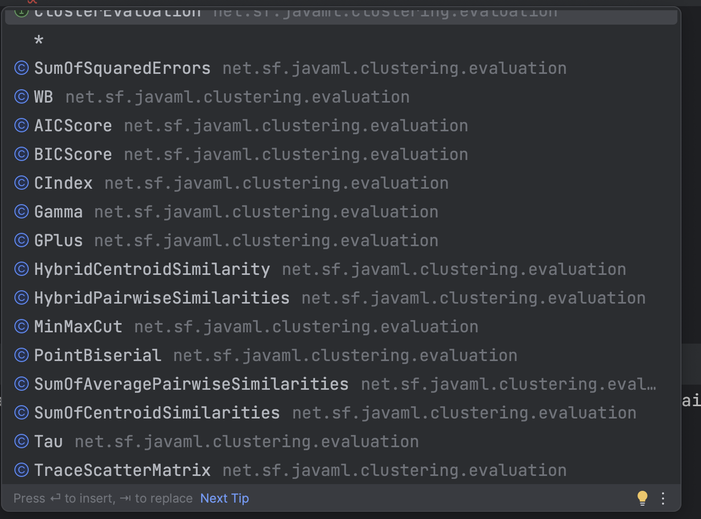

# Test Design Assignment-- input domain modeling -- clustering

In spite of a different algorithm being used when clustering data the method siganture is the same. The only difference is the algorithm used to cluster the data. The method signature is the same because the clustering algorithm is an implementation detail. Each algorithm implements the Clusterer class which allows the clustering algorithm to be swapped out without affecting the rest of the code.

There are multiple possible evaluation techniques for the data clusters, you can see in the figure below the possible evaluation options

In order to evalue an algorithm you must use an evaluation technique, if we need to compare the performance of two or more algorithms we can use the same evaluation technique for all algorithms. The evaluation technique is an implementation detail and is not part of the method signature. 

The output of my code is located [here](output/Output.pdf)

