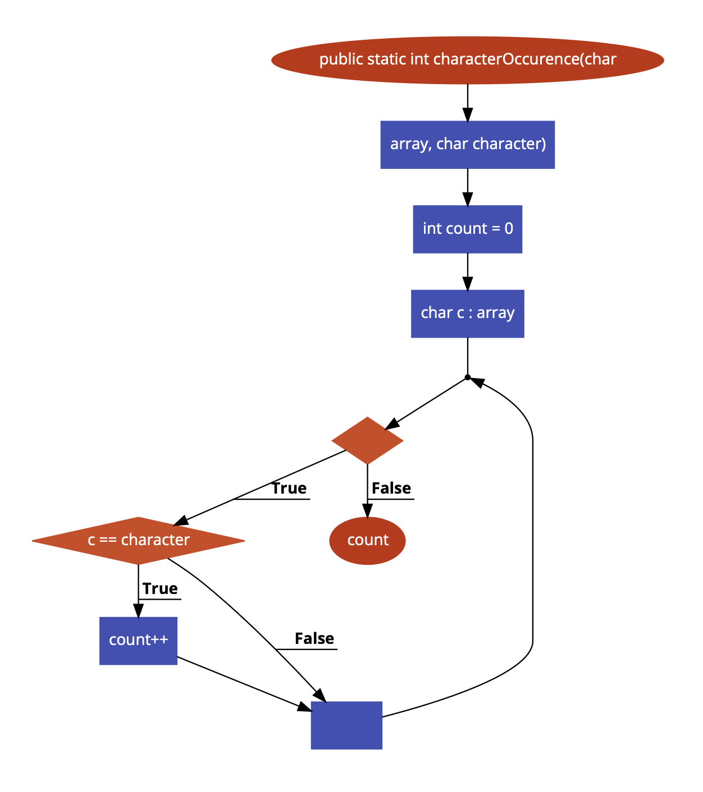

# Test Design Assignment-- white box testing -- part 1

## Control Flow Graph

### Paths for 100% Node Coverage:

- 1
- 1-2-3-4-5-6-7
- 1-2-3-4-5-6-8-7

### Paths for 100% Edge Coverage:

- 1-2-3-4-5-6-7
- 1-2-3-4-5-6-8-7

### Paths for 100% Edge-Pair Coverage:

- 1-2-3-4-5-6-7
- 1-2-3-4-5-6-8-7

### Prime Paths:

- 1
- 1-2-3-4-5-6-7

## Test Cases
| Test Case | Path | Input | Expected Output |
|-----------|------|-------|-----------------|
| 1         | 1    | null  | `NullPointerException` |
| 2         | 1    | `[]`  | `0`               |
| 3         | 1-2-3-4-5-6-7 | `['a', 'b', 'c', 'd', 'a']`, `'a'` | `2` |
| 4         | 1-2-3-4-5-6-7 | `['a', 'b', 'c', 'd', 'a']`, `'e'` | `0` |
| 5         | 1-2-3-4-5-6-8-7 | `['a', 'b', 'c', 'd', 'a']`, `'a'` | `2` |
| 6         | 1-2-3-4-5-6-8-7 | `['a', 'b', 'c', 'd', 'a']`, `'e'` | `0` |

